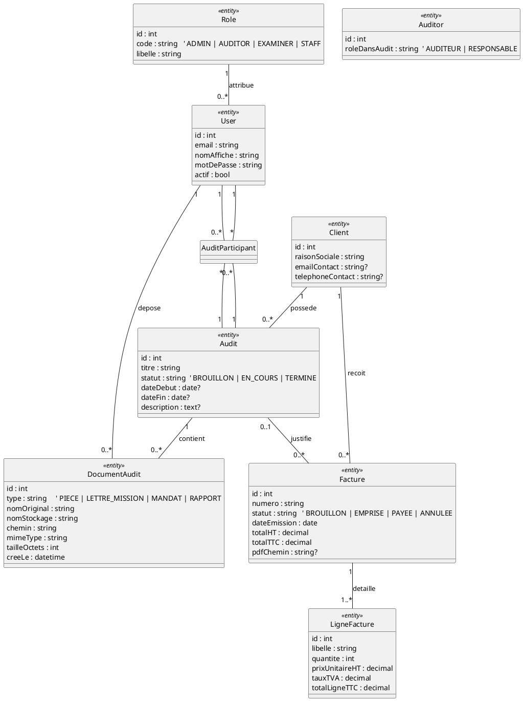

# Cassandre

## 1 Périmètre du projet

### Cassandre V1 : Todo

- Authentification et droits d’accès (selon le rôle)

- Gestion des clients (création, modification, suppression, liste)

- Gestion des audits (création, modification, suppression, liste)

- Ajout de documents sur un audit (dépôt + téléchargement)

- Facturation simple (générer une facture liée à un client et éventuellement à un audit)

- Envoi d’e-mails (au minimum: e-mail de notification ou d’envoi de facture)

   **phase finale**

- Sécurité web de base (protection CSRF, prévention XSS, contrôle d’accès)

- Test final avec OWASP ZAP, puis mise en ligne à la toute fin

### Ce qu’on remet à Cassandre V2

Tout ce qui touche à la vente de certifications, catalogue documentaire public, IA locale, anonymisation automatisée, signatures et processus juridiques complets.

---

## 2 Programme de travail pas à pas (avec livrables)

Règle générale: à chaque étape, l’application fonctionne, on vérifie, puis on sauvegarde (commit).

### Phase 1 - Comprendre et préparer

1. **Analyse du cahier des charges**

   - But: comprendre ce qui est demandé, et surtout ce qui est hors périmètre de la V1.

   - Livrable: liste des fonctionnalités retenues + règles de gestion simples (au format txt, md, docx ...).

2. **Création du dictionnaire des données**

   - But: lister les informations à stocker (nom, type, obligatoire ou non) dans un format lisible et évolutif.

   - Livrable: tableau des champs (ex: Client.nom, Audit.statut, Document.nomFichier, Facture.numero…).

3. **Création du MCD**

   - But: organiser les entités et leurs relations, sans parler de code.

   - Livrable: MCD minimal cohérent avec la version simplifiée (voir PUML plus bas).

4. **Design Figma (maquettes simples)**

   - But: visualiser les écrans pour éviter les retours en arrière.

   - Livrable: maquettes des écrans essentiels: connexion, listes, formulaires, fiche audit, dépôt de document, facture.

---

### Phase 2 - Construire l’interface (avant les entités et la base)

1. **Génération des pages statiques**

   - But: créer la navigation basique et l’apparence avant de brancher la base.

   - Livrable: pages statiques Twig “prêtes” + ( optionnel ) prototype des futures pages dynamiques de l'application avec menus, tableaux, formulaires (sans traitement et datas statiques).

---

### Phase 3 - Construire la base et les entités

1. **Génération des entités** (à partir du MCD)

   - But: transformer le MCD en entités Symfony + base de données.

   - Livrable: entités + migrations générées + base à jour.

2. **Mise en place des validations**

   - But: empêcher les données incohérentes (côté serveur).

   - Livrable: contraintes de validation (champs obligatoires, formats, longueurs, statuts autorisés…).

---

### Phase 4 - Rendre l’application utilisable

1. **Connexion + droits d’accès**

   - But: restreindre l’accès selon le rôle (administratif, auditeur, etc.).

   - Livrable: pages protégées + règles d’accès simples et testées.

2. **Fonctions de gestion (CRUD) + affichage**

   - But: rendre possible la gestion des clients et des audits (make CRUD).

   - Mise en place du panneau d'administration général EasyAdmin

   - Livrable: écrans de liste, création, modification, suppression.

3. **Pagination**

   - But: éviter les listes interminables.

   - Livrable: au moins une liste paginée (ex: audits d’un client).

4. **Dépôt de documents (pièces d’audit)**

   - But: déposer, stocker, consulter et télécharger des fichiers liés à un audit.

   - Livrable: dépôt + téléchargement + règles (taille, type, nom unique, stockage).

---

### Phase 5 - Logique métier (règles de fonctionnement)

1. **Logique métier en PHP (dans Symfony)**

   - But: appliquer les règles de gestion dans le code coté PHP/Symfony.

   - Exemples: numéro de facture, calcul total, changement de statut d’audit.

2. **Logique métier en base de données (si nécessaire)**

   - But: garantir certaines règles même si on contourne l’application.

   - Livrable: migrations écrites à la main pour contraintes, index, déclencheurs si besoin.

---

### Phase 6 - Documents, e-mails, sécurité

1. **Génération des factures (PDF)**

   - Livrable: bouton “générer facture” + stockage du PDF (ou régénération).

2. **Envoi d’e-mails**

   - Livrable: envoi en local (boîte de test), puis configuration réelle plus tard.

3. **Sécurité web (XSS, CSRF, contrôle d’accès, fichiers)**

   - Livrable: protections actives et vérifiées.

---

### Phase 7 - Vérification finale et mise en ligne

1. **Test OWASP ZAP**

   - Livrable: rapport + corrections (au moins 3 alertes traitées).

2. **Mise en ligne (à la toute fin)**

   - Livrable: application stable + base + gestion fichiers + configuration.

---

## 3 MCD minimal (PlantUML) pour faire tourner la version simplifiée

Ton PUML actuel pose déjà l’idée “Role - User - Client - Audit”, avec des participants sur les audits. Je te propose une version “exploitable” qui couvre aussi documents et factures.

Pourquoi ce MCD “fonctionne” pour la planification:

- CRUD clients + audits: **Client** et **Audit**

- Auditeur: **Auditor** (plus simple à gérer que du “many-to-many” brut)

- Upload: **DocumentAudit** lié à Audit et à l’utilisateur qui l’a déposé

- Factures: **Facture** + **LigneFacture**, liées à Client (et optionnellement à Audit)

- Rôles et accès: **Role** + **User**

---

## 4 Fonctions du cahier des charges à réserver pour CassandreV2

Voici ce que je déclare comme “optionnel” pour la V1 de Cassandre:

1. **Module complet de certifications**

   - Vente à l’unité, création dossier candidat, inscription à une session, épreuve, résultats.

2. **Catalogue documentaire public + abonnement + recherche/indexation avancées**

   - Stockage orienté documents (NoSQL avec MongoDB), organisation thématique, moteur de recherche, mises à jour fréquentes.

3. **Assistant IA fonctionnant en local** (intégration + historique + confidentialité)

   - C’est un sous-projet à part entière.

4. **Anonymisation/suppression automatisée des données d’audit**

   - Pseudonymisation, suppression irréversible, conservation chiffrée avec délai d’expiration: trop lourd pour une V1 pédagogique.

5. **Gestion juridique complète des audits**

   - Génération, signature, validation obligatoire avant lancement, archivage: possible plus tard (en V1, on peut juste déposer des documents). (optionnel de l'optionnel : à faire en dernier)

6. **Organisation complète type ERP** (plannings multi-acteurs, tableaux de bord avancés, suivi paiements poussé, relances, etc.)

   - On va garder pousser un tableau de bord EasyAdmin à présenter au jury, mais pas en exigence de V1.
